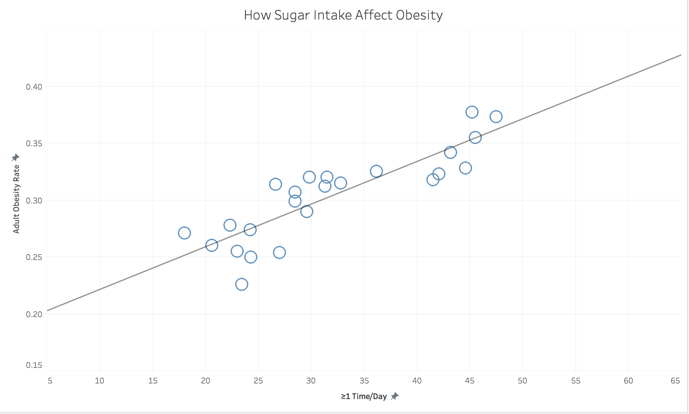

# How can we decrease obesity in the United States?

## Project Statement
Obesity in the United States has been a growing issue for the past few decades. Many people have preconceived notions that obesity is a direct correlation to a person's lifestyle and his/her choices. Because of this, the government and other organizations have tried to intervene by creating fitness programs, adding more funding the physical education programs and community parks, and educating people on the negative impacts it will have in the future. Although these may be useful to help alleviate some of the issues, this is not a definitive solution. Even with all of these initivaties, obesity in the United States continues to grow. 

Collectively we weren't sure why obesity remains a growing issue and what steps should be taken to lower obesity. Because of this curiosity, we decided to see what factors were strongly correlated to obesity. After researching more into obesity and potential factors, we learned that it is a much more complex issue than we first thought. Although we knew that there wasn't a one-to-one relationship, we didn't know that there could be at least ten different factors that play a role in obesity. This puts some perspective into our minds as we can better understand why past initiatives and government intervention weren't as successful as they should have been. 

The following website has very helpful information on obesity in the United States. This was a great starting point for our team to start with the project and will be useful for anyone else who may want more information on this growing issue.

https://stateofobesity.org/

--------

## Project Progression

<b> Data Wrangling: </b>  
All data wrangling steps will be outlined in each individual jupyter notebook that is attached. The goal of this was to be able to clean the data to remove extraneous columns and rows that was not necessary to prove our claim. This allowed us to have ready to use data in Tableau so that we would could focus on the data visualization rather than sorting through all the data.

<b> Literature/Data Sources: </b>  
Below are the links used in this project. These links should also be available in the data visualizations and/or jupyter notebooks.

https://stateofobesity.org/rates/  
https://catalog.data.gov/dataset/nutrition-physical-activity-and-obesity-youth-risk-behavior-surveillance-system  
https://stateofobesity.org/physical-inactivity/  
https://www.cdc.gov/physicalactivity/downloads/pa_state_indicator_report_2014.pdf  

---------
## Prototypes

In this visual we are able to see the ratio between physical inactivity and the number of resources available. More specifically, we can see that Louisianna and Mississippi have the highest levels of physical inactivity and the lowest number of city parks, community centers and sidewalks in their neighborhoods. This visual is good because you can easily compare the states to see which ones need to be focused on. However it can be improved by changing this visual to a scatterplot in which we can see a trend between physical inactivity and resources available. In the next version, I am going to change this to a scatterplot that will include all the states in USA and also plot a trendline to see if there is a strong correlation between the two factors.

In this graph, we can see that youth who watch more television and participate in less physical activity are more obese. This chart is good because it shows three dimensions and adds more complexity. However it is confusion to see television consumption and physical activity side by side. Therefore, in the next version, I am going to take the ratio of tv consumption versus physical activity and then plot that against obesity. This way, we’ll be able to see if physical activity and tv consumption together play an equal role in obesity.

---------

## Final Version:

### What external factors affect obesity in children in the United States? 

 

 

### How Sugar Intake Affects Obesity (Yuhao)
** Suggestion: remove the legend from the screenshot. They're all the same color so the audience won't be able to tell the difference**

### How Availability of Food Affects Obesity (Melvin)
** Suggestion: edit the axises to start at a higher number so that you can see a better view of the chart. 

Some elementary schools in various states offer a free lunch program for kids living in poverty. Here we see that a higher percentage of kids in said program correlates with a higher percentage of kids in the state who are obese. The more readily abundant food is to a person, the higher the chance he grows obese. A lunch program may be helpful in teaching children nutrition education in ways that a parent cannot, but there are other lifestyle factors other than food intake habits that contribute to obesity.

### How Physical Activity Affects Obesity (Elena)

The southern states surrounding Mississippi and Louisianna have some of the lowest numbers of city parks available within their neighborhoods. As a result, physical activity is seen as a lower priority, which leads to higher rates of obesity. Although there is a downward trend that indicates more parks can lead to more physical activity, the correlation isn't that strong so we aren't able to say that parks are the direct cause of physical inactivity. This confirms our claim that obesity is a complex issue that can't be resolved with one solution. However, this is a potential factor that states should keep in mind when creating initiatives to combat obesity. 

 
 In the above chart, we are comparing television consumption and physical activity to obesity levels. We would expect that if you watch more television, there is a direct correlation to obesity. However in the visualization it is evident that television consumption is only directly related to obesity if the youths are not physically active. If a youth is watching several hours of television but is also playing sports for several hours, they are less likely to be obese as they are still getting exercise. This visual has a stronger correlation than city parks and physical activity, which indicate that youths don't necessarily need parks to get exercise. Instead they can find other methods to get exercise such as going for a brisk walk or run around the neighborhood. However, some neighborhoods may not be well developed and may have dangerous street conditions. These states should follow successful initiatives that were implemented by others. 
 
For example, Michigan's Department of Community Health passed a legislation in which the Department of Transportation will consider all types of transportation (pedestrians, bicyclists, motorists and public transportation riders) when they design their transportation. This encourages more people to be physically active as they have easier access to safely walk or bike. Another successful initiative was in Minnesota in which they implemented a Safe Routes to School program. This program fosters a better environment for youths to bike or walk to school. They were able to accomplish this by creating safer routes, educating on the importance of exercise and creating after-school programs that encourage physical activity.

*More information on these initiatives can be found here: https://www.cdc.gov/physicalactivity/downloads/pa_state_indicator_report_2014.pdf

---------------------------------------------------
Meiyuan's - not done
### How education level relates to obesity

### How poverty relates to adult obesity

### How poverty relates to youth obesity

----------
## Future Enhancements
1. 

---------
1. Project statement (Motivation, objective, data, project plan)
2. “Making-of” documentation (Details of your development process, data wrangling steps, your reasoning,
detours, literature, etc.)
3. Several intermediate visualization prototypes
4. Final data visualization
5. Road map with future features/enhancements/features
6. Showcase video (<90 sec)
